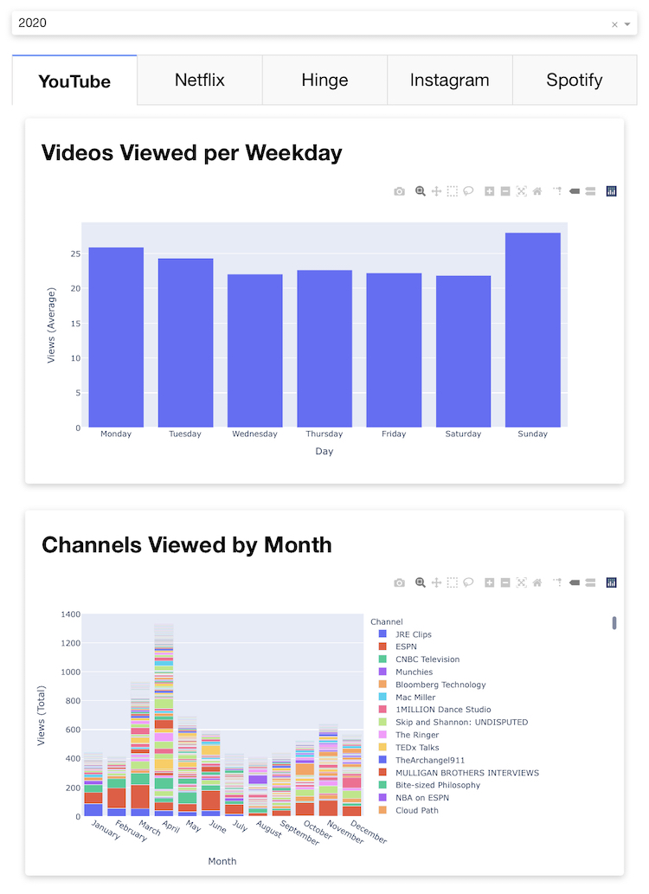
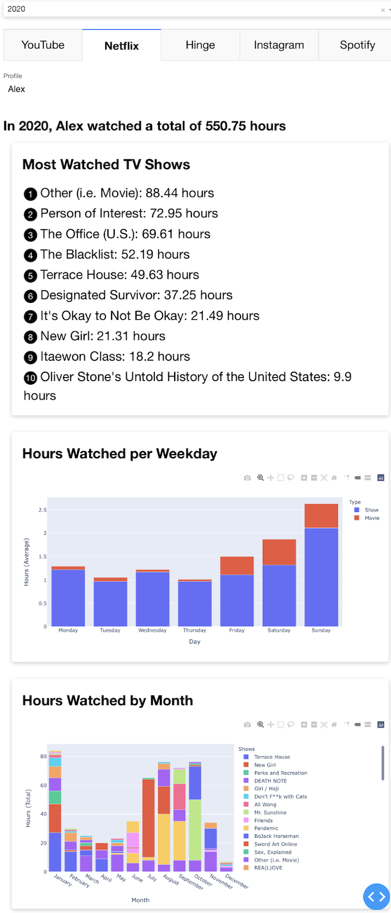
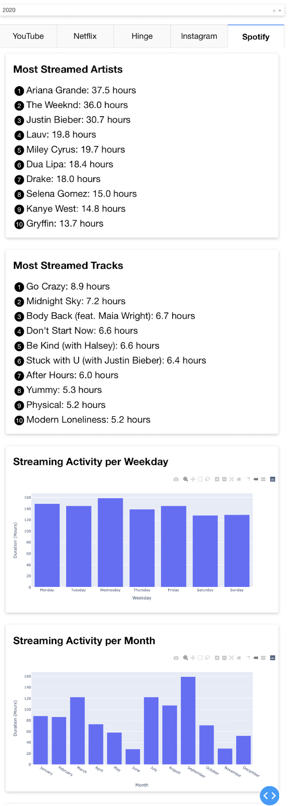
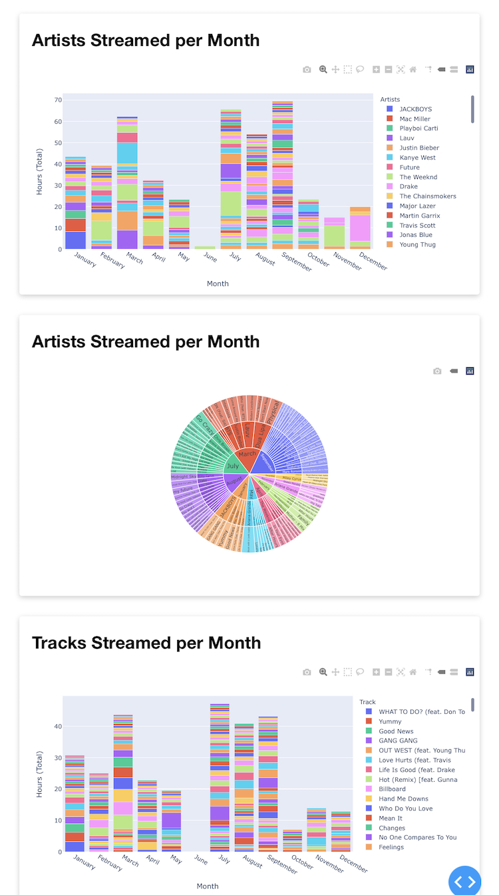
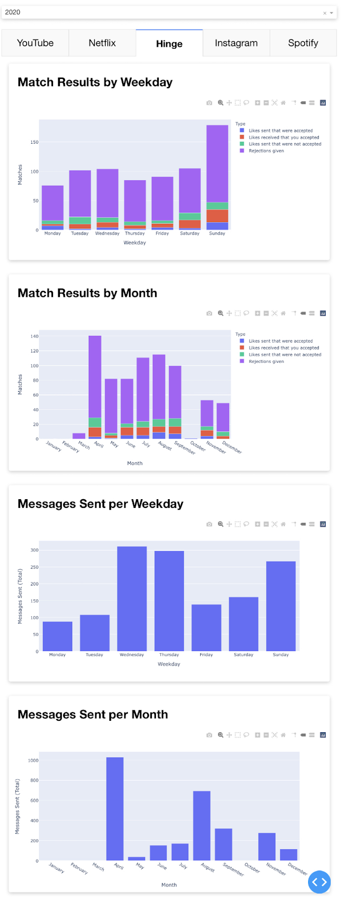

# Personalized Year in Review 🎊 ⒉𝟎⒉𝟎 🎉

Look back on your year's Instagram, YouTube, Netflix, Spotify, and Hinge usage.

## Setup

### Request Personal Data

_5 minutes per app, (requests may take several days)_

| App       | Request Link                                                              | Path to Data                                   |
| --------- | ------------------------------------------------------------------------- | ---------------------------------------------- |
| Instagram | https://www.instagram.com/download/request/                               | data/instagram/                                |
| YouTube   | https://takeout.google.com/settings/takeout                               | data/google/Takeout/YouTube and YouTube Music/ |
| Netflix   | https://www.netflix.com/account/getmyinfo                                 | data/netflix/netflix-report/                   |
| Spotify   | https://www.spotify.com/us/account/privacy/                               | data/spotify/MyData/                           |
| Hinge     | https://hingeapp.zendesk.com/hc/en-us/articles/360004792234-Data-Requests | data/hinge/export/                             |

The first step you need to take to see your Year in Review is to retrieve your data from the companies of which you want to be reviewed. This is only possible thanks to the CCPA (California Consumer Privacy Act) which requires businesses to allow users access to the data being collected about them.

When a company is finished preparing your data, you will receive an email with a link to download it in the form of a `.zip` file. Once you have unzipped the file, a folder should appear. This folder should then be moved into your `year-in-review/data/` folder.

### Install Python3

_0-10 minutes_

You likely already have Python3 installed by default. **Be sure to use `python3` not `python`.** To check on MacOS, follow [these instructions](https://realpython.com/installing-python/#how-to-check-your-python-version-on-a-mac).
If not, follow [these steps](https://realpython.com/installing-python/).

## Visualizations

### Instructions

This is the best way to view your Year in Review. To start it up, move to the `year-in-review` folder in your terminal and run `python3 visualization.py`. This will run a local server and print the URL in your terminal. It should look something like `Dash is running on http://0.0.0.0:8050/`. Open your web browser and go to that URL.

### Screenshots

#### Instagram

TODO

#### YouTube

#### Netflix

#### Spotify

#### Hinge

